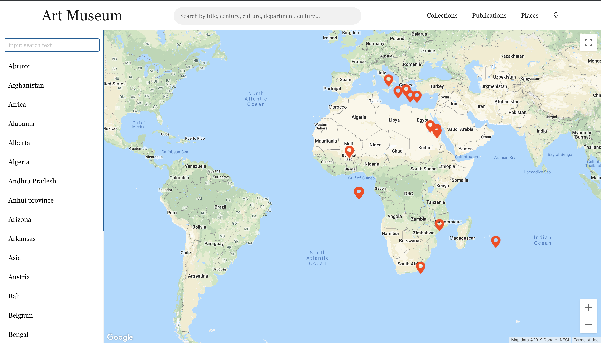

<h1 align="center">
Harvard-arts
</h1>

<p align="center">
Built on Harvard's Art Museum robust API, ART Museum offers a different feel of art collections and publications from the Harvard Art Museum archives.
</p>
<p align="center">
The Places page also leverages the places API related to collections in the Art Archives to deliver you a visual representation of these data using the Google Maps API.
There is also support for theme switching betwen light and dark mode.
</p>

<p align="center">
  
  &nbsp;
  &nbsp;
  &nbsp;
  &nbsp;
  &nbsp;
  
</p>

---

# Table of Contents
* [Demo](https://github.com/Nedson202/Harvard-arts#demo)
* [Features](https://github.com/Nedson202/Harvard-arts#features)
* [Technologies](https://github.com/Nedson202/Harvard-arts#technologies)
* [Installation Setup](https://github.com/Nedson202/Harvard-arts#installation-setup)
* [Language](https://github.com/Nedson202/Harvard-arts#language)
* [Coding style](https://github.com/Nedson202/Harvard-arts#style-guide)
* [Dependencies](https://github.com/Nedson202/Harvard-arts#dependencies)
* [License](https://github.com/Nedson202/Harvard-arts#license)

## Demo
Here is a working live demo: https://art-museum-harvard.netlify.com

## Features
* View art collection objects
* Get detailed information of an object
* View a grid of publications
* Filter publications via a publications timeline
* Get a visual representation of the location of objects using Google Maps API
* Search for collection object with full-text search support via criteria like title, century, accessionmethod, period, technique, classification, department, culture, medium,verificationleveldescription
* PWA support

## Technologies
* React
* Apollo-client
* Google Maps API
* Ant Design - A design system with values of Nature and Determinacy for better user experience of enterprise applications. https://ant.design

## Installation Setup

* **Clone repo:**

  Open **CMD(command prompt)** for windows users, or any other terminal you use.

  ```
    git clone https://github.com/Nedson202/Harvard-arts.git
  ```

* **Install project dependencies:**

  This codebase uses the yarn package manager.

  Enter the following on your Terminal/CMD to change into the directory of the cloned repo and install all app dependencies

  ```
    Install the yarn package manager if you don't have it(optional).

    $ npm i -g yarn


    Change directory to cloned repo (Harvard-arts)

    $ cd Harvard-arts

    Install all dependencies

    $ yarn
  ```


* **Start the app:** Enter the following on your terminal/cmd to start the app

  ```
    $ yarn start
  ```

* **Open browser**

  ```
    Navigate to http://localhost:3000 on the browser
  ```

* **Additional setup:** This app uses the dotenv package to load environment variables. For more info visit [dotenv](https://www.npmjs.com/package/dotenv).

  * Create a .env file in the root directory of the codebase
  * Copy the content of the .env-sample file and add their corresponding values appropriately.
  * Use the following guide to get a Google Maps API key: https://developers.google.com/maps/documentation/javascript/get-api-key

## Language
* Typescript

## Style Guide
* Tslint

## Dependencies
> Click [here](https://github.com/Nedson202/Harvard-arts/blob/develop/package.json) to view all dependencies.

## License

> You can check out the full license [here](https://github.com/Nedson202/Harvard-arts/blob/develop/LICENSE)

This project is licensed under the terms of the MIT license.

